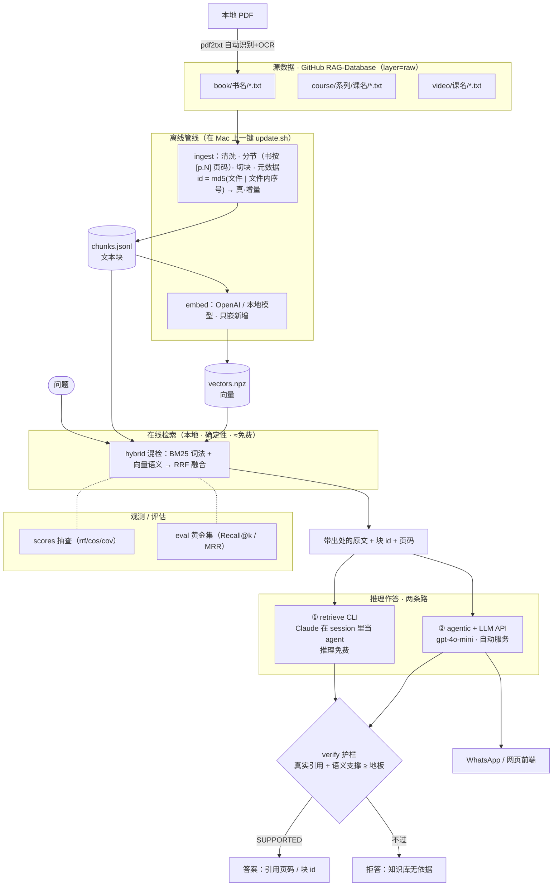
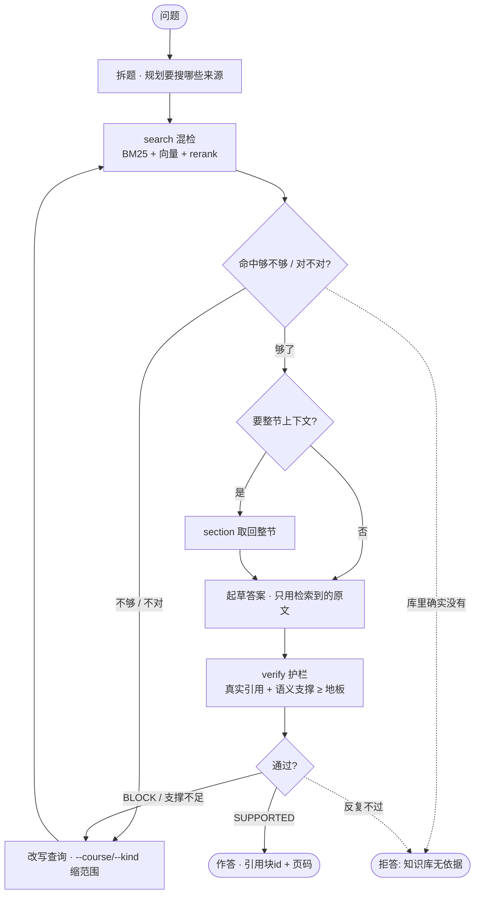

# Knowledge-RAG 架构文档

> 项目的设计基准与 review 依据。记录"为什么存在、怎么组织、如何随规模演进"。
> 标注 **[现状]** = 已实现；**[目标]** = 设计方向/待建。

---

## 1. 这是什么，为什么存在

一个**忠实的、禁止幻觉的、跨领域的个人知识库 agentic RAG**，跑在你自己重抓+清洗的原始学习语料上（课程 / 书 / 视频），由**你自己的 agentic 逻辑**驱动。

三条核心目标：

1. **禁止 AI 幻觉** —— 只回答语料能支撑的内容：grounding + 逐句挂引用 + 引用 verify + 无支撑则**拒答**，绝不编。
2. **跨多个领域回答** —— 一个统一、可无限增长的大库（上千视频 / 上百书 / 大量课程），用元数据（kind / 课程 / 系列）**缩范围**，跨领域也能准确检索。
3. **你自己的 agentic 逻辑** —— 回路（规划 / 迭代检索 / 综合 / 自查 / 拒答）完全可控、可定制，不是黑盒产品。

### 与 NotebookLM 的分工（不是替代，是两件事）

资料已经在 **NotebookLM** 上拆解过一遍，那份**拆解产物是给"人读"的** —— 帮助你消化、理解、内化知识。

| | NotebookLM | 本 RAG |
|---|---|---|
| 角色 | 把资料拆解成**给人读**的产物（帮你理解） | 对原始语料的**可查询、拒绝幻觉、跨领域**问答大脑 |
| 输出对象 | 你自己阅读 | 你提问 / 系统调用（含 WhatsApp 前端） |
| 数据 | 传到 Google | **私有**，留本地 / 你自己的仓库 |
| 规模 | 单 notebook 有源数量上限 | 持久、可**无限增长**的统一库 |
| 行为 | 固定产品 | **你定**：teach 整节取回、拒答、引用 verify、按课程路由、你自己的 agentic 回路 |
| 集成 | 网页 App | 自有 API，可接 WhatsApp 等前端 |

> **语料边界**：只吃 `RAG-Database` 里清洗过的**原始**资料（打 `layer=raw`）。NotebookLM 的拆解产物**不进这个 raw 池**，以保持 raw 池的忠实纯度。

诚实说明：在"通用文档问答质量"上追平 NotebookLM 很难（它背后是 Google + Gemini）。自建的价值**始终在于** NotebookLM 给不了的那几条：规模无上限、数据私有、行为可定制、接自己的前端、你自己的 agentic 逻辑。

---

## 2. 设计原则

1. **忠实优先**：只答语料支撑的；无支撑拒答；逐句挂引用；确定性 `verify` 核对，防编造引用。
2. **确定性工具 + LLM 自主**（BCA M08「能 workflow 就别 agent」）：
   - 确定性（代码，可审计、稳）：分块 / 检索 / RRF / 引用核对；
   - Agentic 自主（LLM）：① 规划 ② 判断"够不够" ③ 综合 ④ 引用自查。
3. **接缝可换**：agent 只依赖 `Retriever` 接口；规模变化时换检索实现，**agent 零改动**。
4. **源与索引分离**：文本源在 GitHub 私有仓库（唯一真源）；`chunks.jsonl` / 索引是**派生产物**，可随时重建。
5. **前端即适配层**：CLI、WhatsApp 都是薄前端，共用同一个 agentic 核心。

---

## 3. 总览与数据流



---

## 4. 组件

| 模块 | 职责 | 状态 |
|---|---|---|
| `kb_rag/ingest.py` | 原始资料 → `chunks.jsonl`：清洗字幕、按类型分节、切块、打元数据 | [现状] |
| `kb_rag/pdf2txt.py` | 本地 PDF → txt，自动识别文字版/扫描版/混合版并 OCR（book 语料） | [现状] |
| `kb_rag/engine.py` | 确定性检索核 + 工具（search/fetch_section/outline/list_courses/verify），内存 BM25+TFIDF·RRF | [现状] |
| `kb_rag/retriever.py` | `Retriever` 接口（检索接缝），agent 依赖它而非具体 engine | [现状] |
| `kb_rag/agent.py` | 半 agentic 管线 + 可插后端（Mock / Anthropic），离线 mock 可测 | [现状] |
| `kb_rag/agentic.py` | 真 agentic：engine 工具 → Claude tools 的原生 tool-use 回路（`ToolAgent`） | [现状] |
| `kb_rag/cli.py` | 命令行前端：ask / teach / courses | [现状] |
| `kb_rag/server.py` | WhatsApp(Twilio) 前端：webhook + 异步跑 Agent + 回发 | [现状] |

---

## 5. 数据模型

### 目录约定（分类桶 + 系列 + 课名）

```
course/[系列/]课名/*.txt        kind=course
book/[分类/]书名/书.txt         kind=book
video/[系列/]课名/*.txt         kind=video
```
- **桶名** → `kind`；**最深层文件夹** → 课名/书名；**中间层** → `series`（分组，可多级）。
- 前缀平铺（`Book_书名/`、`Video_课名/`）亦兼容。

### chunks.jsonl（一行一块）

```json
{"id","course","kind","layer","series","section","order","text"}
```
- `layer=raw`（忠实原料）；`order` 全局递增，保原文顺序；`section` 用于教学整节取回。

### 分块策略（按类型）

| kind | 分节 | 状态 |
|---|---|---|
| course / video（短字幕） | 有 `##` 标题按标题；否则**整篇一节**，节名=文件名（避免跨文件撞名） | [现状] |
| book（几百页） | **按章节/页分节**（用 `[p.N]` 页码标记），合并断行，页码进元数据以支持页级引用 | [目标] |

---

## 6. Agentic 回路

**核心回路**（写在 `CLAUDE.md`，本地 Claude 每次问答照此走）：



**为什么是"agentic"而非简单引索**：不是"检索一次就塞给 LLM"，而是一个带判断的回路——
判断命中够不够 → 不够就**多轮改写检索**、按 course/kind 缩范围 → 需要细节就 `section` 取整节 →
跨领域时在不同来源分别搜再综合 → 出答案前用 `verify` **硬核对**，不过就回去重搜或拒答。
单发检索会漏的题，多轮回路能兜住（实测：跨语言 HITL 题单发 MISS，实际问答靠多轮 + 跨来源答对）。

**两种实现，同一套逻辑**：

- **本地免费版（主用）**：Claude 在 VS Code/CLI session 里**就是 agent**，用 bash 调 `retrieve` 的
  search/section/outline/courses/verify。推理走 Claude 订阅，**0 按量费**。回路即 `CLAUDE.md` 的纪律。
- **API 版（`agentic.py` · `ToolAgent`/`OpenAIToolAgent`）**：把这些工具注册成 LLM 原生 tools，
  在 tool-use 循环里自主决定调哪个/几次/何时 answer（`MAX_STEPS` + 最后一步强制 answer 兜底）。
  全自动、按量收费，留给 WhatsApp 等无人值守场景。

**三个"自己的"设计**：① 纪律写死在 `CLAUDE.md`（只引原文、必须核对、宁拒答不编造）；
② veto 是**确定性代码**（`verify` 用 embedding 算支撑分），不是模型自觉；
③ "能 workflow 就不 agent"——确定性检索交本地代码（便宜），只在推理/改写/综合/判断处动用 LLM 自主性。

---

## 7. 检索的规模化路线

目标规模：**上千视频 + 上百书 + 大量课程 → 几十万至百万级块**。分阶段演进，每阶段实现同一 `Retriever` 接口、配置切换：

| 阶段 | 规模 | 检索实现 | 关键点 |
|---|---|---|---|
| 现在 | 数万块 | 内存 BM25（engine）+ **HybridRetriever(BM25+向量·RRF)** [现状] | 向量矩阵在内存/`.npy` |
| 中 | 十万~ | 磁盘型向量库(sqlite-vec/Qdrant embedded) | 从磁盘分页，适配低配机器 |
| 大 | 百万+ | Qdrant/pgvector + ANN + 增量摄取 | payload 过滤、增量 upsert |

**embedding 决策（低配 Mac / 自用）**：算力外包 **API**（OpenAI `text-embedding-3-small` 或 Voyage `voyage-3`，中文更强），**不本地跑 BGE-M3**（低配机嵌百万块不现实）；向量现在内存、将来落磁盘。换模型 = 全量重嵌。

**大规模的三个要点**：

1. **混合检索**：向量（语义，近义/换说法）+ BM25（词面），RRF 融合（复用现有 `_rrf`）。
2. **embedding 供应商**（待定）：Voyage（Anthropic 推荐）/ OpenAI / 本地 —— ⚠️ Anthropic 无 embedding API，必须外接。
3. **元数据过滤 + agentic 缩范围**：百万块里"一把 top-k"必然吵，**先按 kind/课程/系列缩范围再检索**是降噪关键——这让 agentic 回路在大规模下从"锦上添花"变成"刚需"。

**增量摄取** [目标]：按内容哈希/id 记录已入库，只处理新增/变更；块 id 用"源+位置"哈希，支持幂等 upsert。

---

## 8. 前端

| 前端 | 说明 | 状态 |
|---|---|---|
| CLI | `python -m kb_rag.cli ask/teach/courses`；`--backend anthropic` 用真 Claude | [现状] |
| WhatsApp (Twilio) | webhook 收 → 立即 200 → 后台异步跑 Agent → REST 回发；per-user 会话记住选课；指令 `/courses /use /teach` | [现状] |

两者共用同一 agentic 核心，Agent 不感知前端。

---

## 9. 现状与待办

**[现状] 已实现**
- 确定性核 + 半 agentic 回路（Mock/Anthropic 双后端），端到端可跑；
- 课程 / 书 / 视频 三桶 + 系列/序号 目录；无标题字幕整篇一节（teach 精确到每节课）；
- `Retriever` 接口接缝；PDF→txt 全自动（文字/扫描/混合，OCR）；
- CLI + WhatsApp 双前端；真 Claude 后端四决策点。

- **真 agentic 回路**（`agentic.py`）：Claude 原生 tool-use，自主检索/缩范围/改写/verify/拒答，CLI `ask --agentic`。
- **确定性 veto 护栏**（`agentic.py`·`_finalize`）：裁决权归代码——编造引用/幻觉答案/无支撑一律拦截，零编造引用逃逸。
- **真·混合检索**（`hybrid.py`·`HybridRetriever`）：BM25 + 向量语义 RRF 融合 + 元数据过滤；`embed.py` 可插拔 embedder（OpenAI/Voyage/Fake）；`buildindex.py` 建 `.npy` 索引；CLI `ask --hybrid`。

- **增量嵌入**（`vecstore.py`·`buildindex.py`）：向量按 chunk id 存(.npz)，扩数据只嵌新块、复用旧向量；分批落盘可断点续。
- **批量嵌入**（`batchembed.py`）：大规模用 OpenAI Batch API —— submit 后关终端、稍后 fetch，异步/便宜50%/不撞速率限，增量只提交新块。
- **多后端 LLM**：`agentic.py` 支持 Anthropic（`ToolAgent`）与 OpenAI（`OpenAIToolAgent`），CLI 按环境 key 自动选；veto 护栏用**语义核对**（embedding 余弦，抗意译/跨语言）。

**[目标] 待建（按优先级）**
1. **book 专门分节**：PDF/书按章节/页切、合并断行、页级引用；
2. **磁盘型向量库**：数据涨到十万+时换 sqlite-vec/Qdrant（现为内存向量 + .npz 增量存）；
3. **rerank(utility 加权) / query-rewrite**、**评估黄金集 + 可观测性**。
